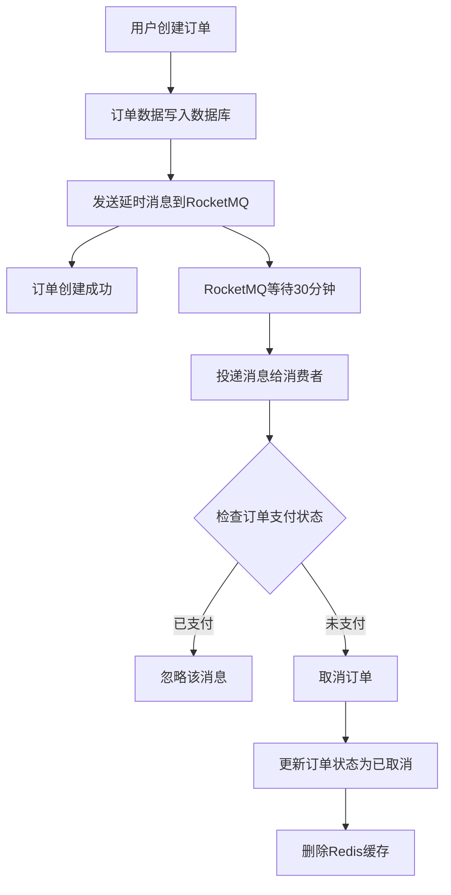

# RocketMQ 订单超时自动取消功能说明

## 功能概述

在订单创建时发送一个延时消息（30分钟），RocketMQ 在30分钟后将消息投递给消费者，消费者检查订单支付状态，如果订单仍未支付则自动取消订单。

## 实现流程



## 核心文件说明

### 1. DTO 类
- **OrderTimeoutMessageDTO.java**: 订单超时消息数据传输对象
  - 包含订单号、用户ID、店铺ID

### 2. 常量类
- **RocketMQConstants.java**: RocketMQ Topic 和 Tag 常量
  - TOPIC_ORDER: 订单相关主题
  - TAG_ORDER_TIMEOUT: 订单超时检查标签

### 3. 生产者
- **OrderTimeoutProducer.java**: 订单超时消息生产者
  - `sendOrderTimeoutMessage()`: 发送延时消息
  - 支持18个延迟级别（1s~2h）
  - 延迟级别16对应30分钟

### 4. 消费者
- **OrderTimeoutConsumer.java**: 订单超时消息消费者
  - 监听 `TOPIC_ORDER:TAG_ORDER_TIMEOUT`
  - 收到消息后检查订单支付状态
  - 如果未支付则取消订单并清理缓存

### 5. 业务集成
- **OrderServiceImpl.java**: 订单服务实现
  - 在订单创建成功后发送延时消息
  - 消息发送失败不影响订单创建主流程

### 6. 测试接口
- **RocketMQTestController.java**: RocketMQ测试控制器
  - `/test/mq/send-timeout`: 发送超时消息
  - `/test/mq/generate-test`: 生成测试消息（1分钟延迟）

## 配置说明

### application.yaml
```yaml
rocketmq:
  name-server: 172.17.156.101:9876  # RocketMQ NameServer地址
  producer:
    group: order-producer-group      # 生产者组名
    send-message-timeout: 3000       # 发送超时时间（毫秒）
    retry-times-when-send-failed: 2  # 同步发送失败重试次数
    retry-times-when-send-async-failed: 2  # 异步发送失败重试次数
```

### pom.xml 依赖
```xml
<dependency>
    <groupId>org.apache.rocketmq</groupId>
    <artifactId>rocketmq-spring-boot-starter</artifactId>
    <version>2.3.1</version>
</dependency>
```

## RocketMQ 延迟级别

| 级别 | 延迟时间 | 级别 | 延迟时间 |
|------|----------|------|----------|
| 1    | 1秒      | 10   | 6分钟    |
| 2    | 5秒      | 11   | 7分钟    |
| 3    | 10秒     | 12   | 8分钟    |
| 4    | 30秒     | 13   | 9分钟    |
| 5    | 1分钟    | 14   | 10分钟   |
| 6    | 2分钟    | 15   | 20分钟   |
| 7    | 3分钟    | 16   | **30分钟** |
| 8    | 4分钟    | 17   | 1小时    |
| 9    | 5分钟    | 18   | 2小时    |

## 使用示例

### 1. 正常订单创建流程
订单创建时会自动发送30分钟延时消息，无需额外操作。

### 2. 测试延时消息
```bash
# 发送30分钟延迟的超时检查消息
POST /test/mq/send-timeout
Content-Type: application/json

{
  "orderSn": 123456789,
  "userId": 1,
  "shopId": 1
}

# 发送1分钟延迟的测试消息（用于快速验证）
POST /test/mq/generate-test
```

## 关键特性

### 1. 幂等性保证
- 消费者会检查订单当前状态
- 只有待支付且未支付的订单才会被取消
- 已支付或已取消的订单会被忽略

### 2. 异常处理
- 消息发送失败不影响订单创建
- 消费者处理失败会触发重试机制
- 重试超过最大次数后进入死信队列

### 3. 性能优化
- 延时消息不占用系统资源直到到期
- 消费者集群部署，负载均衡消费
- Redis缓存及时清理，避免内存泄漏

## 注意事项

1. **RocketMQ服务**: 确保 RocketMQ NameServer 和 Broker 正常运行
2. **Topic创建**: 确保 `TOPIC_ORDER` 主题已创建（可配置自动创建）
3. **时钟同步**: 确保应用服务器和RocketMQ服务器时钟同步
4. **延迟限制**: RocketMQ最多支持2小时延迟，如需更长延迟需自行实现
5. **消息可靠性**: 延时消息具有持久化保证，即使Broker重启也不会丢失

## 扩展建议

1. **库存恢复**: 在取消订单时可以添加库存恢复逻辑
2. **通知用户**: 取消订单后发送站内信或短信通知用户
3. **记录日志**: 记录订单取消原因和时间，便于数据分析
4. **监控告警**: 监控超时订单数量，异常情况及时告警
5. **灵活配置**: 将延迟时间配置化，支持不同商品设置不同超时时间

## 常见问题

### Q1: 为什么消息发送失败不影响订单创建？
A: 订单创建是核心业务，必须保证成功。超时检查是辅助功能，即使失败也不应影响主流程。可以通过定时任务补偿处理。

### Q2: 如果消费者处理失败怎么办？
A: RocketMQ会自动重试，默认重试16次，每次间隔时间递增。超过最大重试次数后进入死信队列，需要人工干预。

### Q3: 如何修改超时时间？
A: 修改 OrderServiceImpl 中调用 `sendOrderTimeoutMessage()` 时的 delayLevel 参数。参考上面的延迟级别表选择合适的值。

### Q4: 能否实现更长的延迟（如24小时）？
A: RocketMQ原生最多支持2小时延迟。如需更长延迟，可以：
   - 方案1：使用定时任务扫描超时订单
   - 方案2：发送多条延时消息串联
   - 方案3：使用其他中间件（如Redis ZSet + 定时任务）
