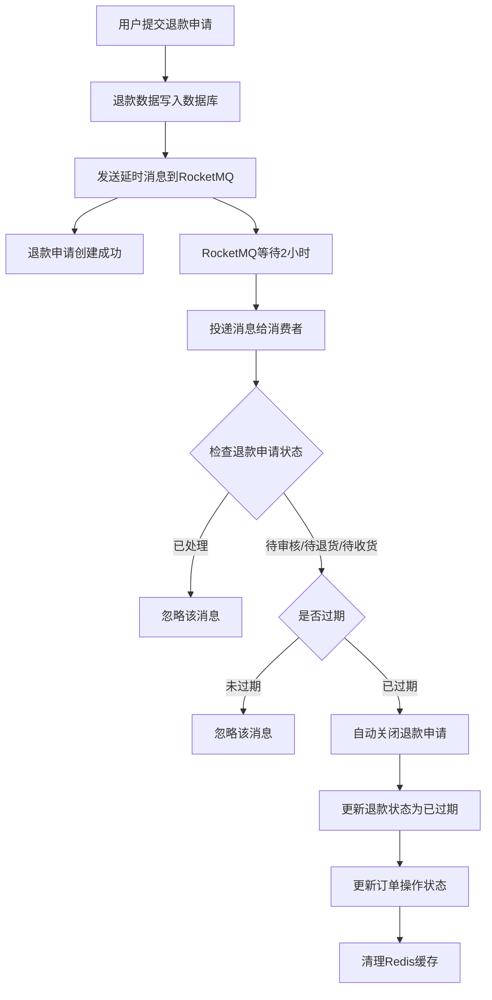
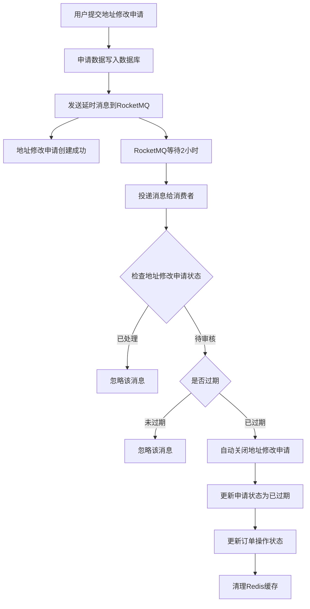

# RocketMQ 退款和地址修改超时自动处理功能说明

## 功能概述

在退款申请和地址修改申请创建时发送延时消息，RocketMQ 在指定时间后将消息投递给消费者，消费者检查申请状态，如果超时未处理则自动关闭申请。

## 实现流程

### 1. 退款超时处理流程



### 2. 地址修改超时处理流程



## 核心文件说明

### 1. DTO 类

#### RefundTimeOutMessage.java
- **位置**: `DXShop-order/src/main/java/com/daxi/domain/dto/RefundTimeOutMessage.java`
- **用途**: 退款超时消息数据传输对象
- **字段**:
  - `refundId`: 退款ID
  - `orderId`: 订单号
  - `userId`: 用户ID
  - `shopId`: 店铺ID

#### AddressModifyTimeoutMessageDTO.java
- **位置**: `DXShop-order/src/main/java/com/daxi/domain/dto/AddressModifyTimeoutMessageDTO.java`
- **用途**: 地址修改超时消息数据传输对象
- **字段**:
  - `orderId`: 订单号
  - `userId`: 用户ID
  - `shopId`: 店铺ID

### 2. 常量类

#### RocketMQConstants.java
- **位置**: `DXShop-order/src/main/java/com/daxi/constants/RocketMQConstants.java`
- **新增常量**:
  ```java
  // 退款相关
  public static final String TOPIC_REFUND = "TOPIC_REFUND";
  public static final String TAG_REFUND_TIMEOUT = "TAG_REFUND_TIMEOUT";
  
  // 地址修改相关
  public static final String TOPIC_ADDRESS_MODIFY = "TOPIC_ADDRESS_MODIFY";
  public static final String TAG_ADDRESS_MODIFY_TIMEOUT = "TAG_ADDRESS_MODIFY_TIMEOUT";
  ```

### 3. 生产者

#### RefundTimeOutProducer.java
- **位置**: `DXShop-order/src/main/java/com/daxi/mq/producer/RefundTimeOutProducer.java`
- **功能**: 发送退款超时检查延时消息
- **方法**: `sendRefundTimeOutMessage(RefundTimeOutMessage message, int delayLevel)`

#### AddressModifyTimeoutProducer.java
- **位置**: `DXShop-order/src/main/java/com/daxi/mq/producer/AddressModifyTimeoutProducer.java`
- **功能**: 发送地址修改超时检查延时消息
- **方法**: `sendAddressModifyTimeoutMessage(AddressModifyTimeoutMessageDTO message, int delayLevel)`

### 4. 消费者

#### RefundTimeOutComsumer.java
- **位置**: `DXShop-order/src/main/java/com/daxi/mq/consumer/RefundTimeOutComsumer.java`
- **消费者组**: `refund-timeout-consumer-group`
- **监听**: `TOPIC_REFUND:TAG_REFUND_TIMEOUT`
- **功能**:
  - 接收退款超时检查消息
  - 查询退款申请当前状态
  - 检查是否已过期
  - 如果超时未处理，自动关闭退款申请
  - 更新订单操作状态
  - 清理 Redis 缓存

#### AddressModifyTimeoutConsumer.java
- **位置**: `DXShop-order/src/main/java/com/daxi/mq/consumer/AddressModifyTimeoutConsumer.java`
- **消费者组**: `address-modify-timeout-consumer-group`
- **监听**: `TOPIC_ADDRESS_MODIFY:TAG_ADDRESS_MODIFY_TIMEOUT`
- **功能**:
  - 接收地址修改超时检查消息
  - 查询地址修改申请当前状态
  - 检查是否已过期
  - 如果超时未处理，自动关闭地址修改申请
  - 更新订单操作状态
  - 清理 Redis 缓存

### 5. 业务集成

#### OrderServiceImpl.java
- **位置**: `DXShop-order/src/main/java/com/daxi/service/impl/OrderServiceImpl.java`
- **集成点**:
  1. **退款申请** (`sendRefunds` 方法):
     - 在退款申请创建成功后发送延时消息
     - 消息发送失败不影响退款申请主流程
  
  2. **地址修改申请** (`updateAddress` 方法):
     - 在地址修改申请创建成功后发送延时消息
     - 消息发送失败不影响地址修改申请主流程

## 配置说明

### application.yaml
```yaml
rocketmq:
  name-server: 172.17.156.101:9876  # RocketMQ NameServer地址
  producer:
    group: order-producer-group      # 生产者组名
    send-message-timeout: 3000       # 发送超时时间（毫秒）
    retry-times-when-send-failed: 2  # 同步发送失败重试次数
    retry-times-when-send-async-failed: 2  # 异步发送失败重试次数
```

## RocketMQ 延迟级别

| 级别 | 延迟时间 | 级别 | 延迟时间 |
|------|----------|------|----------|
| 1    | 1秒      | 10   | 6分钟    |
| 2    | 5秒      | 11   | 7分钟    |
| 3    | 10秒     | 12   | 8分钟    |
| 4    | 30秒     | 13   | 9分钟    |
| 5    | 1分钟    | 14   | 10分钟   |
| 6    | 2分钟    | 15   | 20分钟   |
| 7    | 3分钟    | 16   | 30分钟   |
| 8    | 4分钟    | 17   | 1小时    |
| 9    | 5分钟    | 18   | 2小时    |

**注意**: 
- 退款申请原本需要3天超时，地址修改申请需要3小时超时
- RocketMQ 原生最多支持2小时延迟（级别18）
- 当前使用最大延迟级别18（2小时），配合定时任务进行补偿处理
- 如需更长延迟，建议方案：
  1. 使用 XXL-JOB 定时任务扫描超时申请
  2. 发送多条延时消息串联
  3. 使用 Redis ZSet + 定时任务

## 关键特性

### 1. 幂等性保证
- 消费者会检查申请当前状态
- 只有待处理且已过期的申请才会被关闭
- 已处理的申请会被忽略

### 2. 异常处理
- 消息发送失败不影响主业务流程
- 消费者处理失败会触发重试机制
- 重试超过最大次数后进入死信队列，需要人工干预

### 3. 性能优化
- 延时消息不占用系统资源直到到期
- 消费者集群部署，负载均衡消费
- Redis 缓存及时清理，避免内存泄漏

### 4. 数据一致性
- 先更新数据库，再更新缓存
- 缓存更新失败记录日志，不影响主流程
- 通过消息重试机制保证最终一致性

## 注意事项

1. **RocketMQ服务**: 确保 RocketMQ NameServer 和 Broker 正常运行
2. **Topic创建**: 确保 `TOPIC_REFUND` 和 `TOPIC_ADDRESS_MODIFY` 主题已创建（可配置自动创建）
3. **时钟同步**: 确保应用服务器和RocketMQ服务器时钟同步
4. **延迟限制**: RocketMQ最多支持2小时延迟，如需更长延迟需自行实现
5. **消息可靠性**: 延时消息具有持久化保证，即使Broker重启也不会丢失
6. **消费者组**: 确保消费者组名称唯一，避免与其他服务冲突

## 扩展建议

1. **通知用户**: 超时关闭申请后发送站内信或短信通知用户
2. **记录日志**: 记录申请超时关闭原因和时间，便于数据分析
3. **监控告警**: 监控超时申请数量，异常情况及时告警
4. **灵活配置**: 将延迟时间配置化，支持不同场景设置不同超时时间
5. **定时任务补偿**: 添加 XXL-JOB 定时任务，扫描并处理超过2小时的申请

## 常见问题

### Q1: 为什么消息发送失败不影响申请创建？
A: 申请创建是核心业务，必须保证成功。超时检查是辅助功能，即使失败也不应影响主流程。可以通过定时任务补偿处理。

### Q2: 如果消费者处理失败怎么办？
A: RocketMQ会自动重试，默认重试16次，每次间隔时间递增。超过最大重试次数后进入死信队列，需要人工干预。

### Q3: 如何修改超时时间？
A: 修改 OrderServiceImpl 中调用生产者方法时的 delayLevel 参数。参考上面的延迟级别表选择合适的值。

### Q4: 能否实现更长的延迟（如3天）？
A: RocketMQ原生最多支持2小时延迟。如需更长延迟，可以：
   - 方案1：使用定时任务扫描超时申请（推荐）
   - 方案2：发送多条延时消息串联
   - 方案3：使用其他中间件（如Redis ZSet + 定时任务）

## 测试建议

### 1. 快速验证（使用短延迟）
修改 delayLevel 为较小的值（如 5 = 1分钟）进行快速验证

### 2. 监控日志
```bash
# 实时查看应用日志
tail -f ./logs/DXShop-order.log

# 筛选RocketMQ相关日志
grep "超时检查" ./logs/DXShop-order.log
```

### 3. 数据库验证
```sql
-- 查询待审核的退款申请
SELECT * FROM order_refund WHERE status = 1;

-- 查询已过期的退款申请
SELECT * FROM order_refund WHERE status = 5;

-- 查询待审核的地址修改申请
SELECT * FROM order_address_modify WHERE status = 1;

-- 查询已过期的地址修改申请
SELECT * FROM order_address_modify WHERE status = 4;
```
